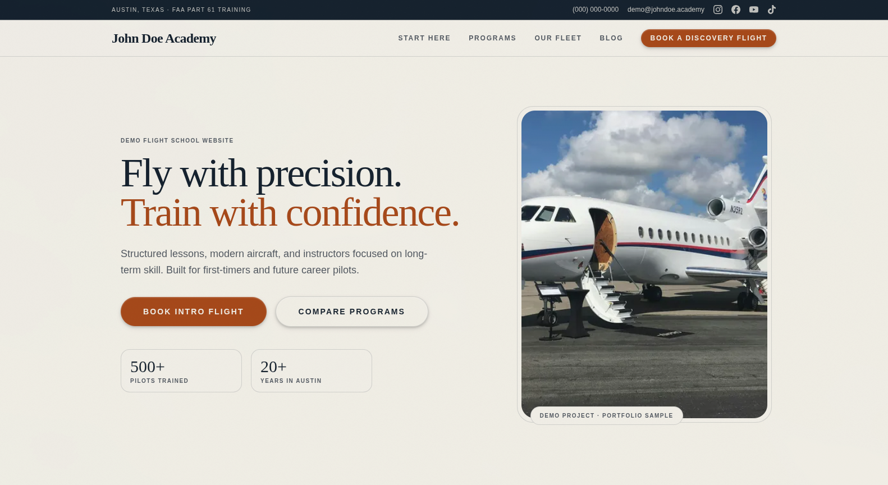
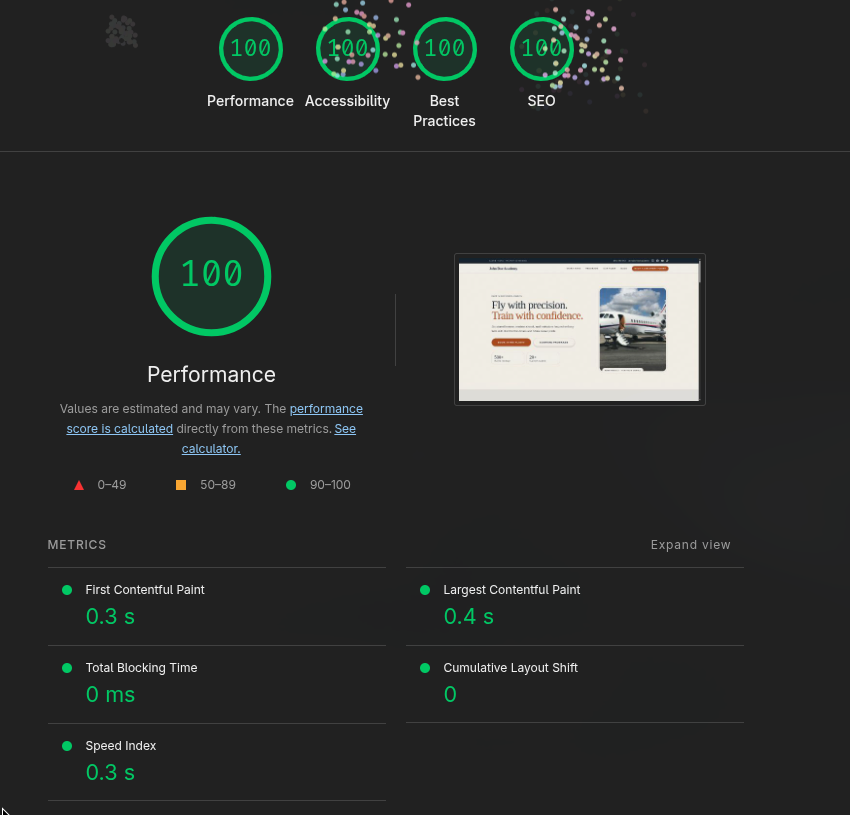

# John Doe Academy Demo

Simple Astro flight academy demo site.

## Live demo

https://fly.codename.com.br

## Screenshots

## Technologies used

- Astro 5
- Tailwind CSS 4
- Astro Content Collections
- Astro Sitemap

## Commands

- `npm install` - install dependencies
- `npm run dev` - run dev server
- `npm run build` - build for production
- `npm run preview` - preview production build
- `npm run lint` - run linter

## Notes

- Brand and contact data are demo-only (`John Doe Academy`)
- Contact form is frontend-only (no real CRM/webhook integration)
